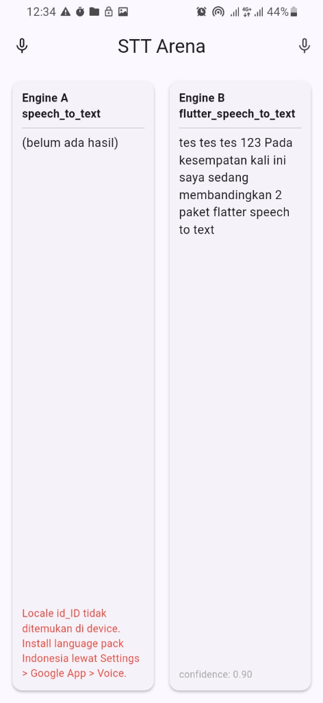

# STT Arena

Proyek Flutter untuk membandingkan dua paket Speech-to-Text (STT) secara berdampingan:

- **Engine A** — [`speech_to_text`](https://pub.dev/packages/speech_to_text) ^7.4.0
- **Engine B** — [`flutter_speech_to_text`](https://pub.dev/packages/flutter_speech_to_text) ^1.2.1

---

## Screenshot



> Engine A (kiri) menunjukkan error locale `id_ID` belum terpasang di device.  
> Engine B (kanan) berhasil mentranskripsi dengan confidence 0.90.

---

## ✅ Temuan & Rekomendasi

**Engine B (`flutter_speech_to_text`) dipilih untuk produksi** karena alasan berikut:

### Engine A gagal di device tanpa language pack

`speech_to_text` **wajib memvalidasi locale** dari daftar resmi yang dilaporkan device sebelum bisa mulai merekam:

```dart
// Engine A — harus cari locale dulu dari daftar device
final locales = await _speech.locales(); // ambil daftar resmi
for (final l in locales) {
  if (id == 'id_id' || id == 'in_id' ...) {
    _resolvedLocaleId = l.localeId; // baru boleh dipakai
  }
}
// Kalau tidak ketemu → error:
// "Locale id_ID tidak ditemukan di device.
//  Install language pack Indonesia lewat Settings > Google App > Voice."
```

Artinya: kalau di **daftar resmi device** tidak ada entri untuk Bahasa Indonesia (misalnya language pack belum terinstall atau belum terdaftar di Google App), Engine A langsung error seperti yang terlihat di screenshot di atas.

### Engine B langsung jalan tanpa validasi

`flutter_speech_to_text` meneruskan kode bahasa **langsung ke native Speech Recognizer** Android/iOS tanpa validasi terlebih dahulu:

```dart
// Engine B — langsung lempar ke OS, OS yang handle
await _speech.start(language: 'id-ID'); // langsung jalan ✅
```

Android modern cukup pintar — ia tahu `id-ID` adalah Bahasa Indonesia dan bisa menyesuaikan model pengenalan suaranya secara dinamis, bahkan tanpa language pack yang terinstall secara eksplisit.

| | Engine A (`speech_to_text`) | Engine B (`flutter_speech_to_text`) |
|---|---|---|
| **Validasi locale** | ❌ Wajib ada di daftar device | ✅ Tidak perlu, langsung ke OS |
| **Tanpa language pack** | ❌ Error, tidak bisa jalan | ✅ Tetap jalan |
| **Kemudahan setup** | Lebih kompleks | Lebih sederhana |

> **Kesimpulan:** Untuk aplikasi yang menyasar pengguna umum dengan konfigurasi device yang beragam, Engine B jauh lebih robust karena tidak bergantung pada keberadaan language pack di device pengguna.

---

## Perbedaan `speech_to_text` vs `flutter_speech_to_text`

### Sekilas

| | `speech_to_text` (Engine A) | `flutter_speech_to_text` (Engine B) |
|---|---|---|
| **pub.dev** | [pub.dev/packages/speech_to_text](https://pub.dev/packages/speech_to_text) | [pub.dev/packages/flutter_speech_to_text](https://pub.dev/packages/flutter_speech_to_text) |
| **Popularitas** | ⭐ Sangat populer, ribuan pengguna | Lebih baru, komunitas lebih kecil |
| **API style** | Callback-based (`onResult`, `onStatus`, `onError` via `initialize()`) | Stream-based (`onResult`, `onError`, `onEnd` sebagai `Stream`) |
| **Cara mulai** | `_stt.listen(onResult: ...)` | `_stt.start(language: ...)` |
| **Cara berhenti** | `_stt.stop()` | `_stt.stop()` |
| **Deteksi berhenti otomatis** | Via callback `onStatus` → cek `'done'` atau `'notListening'` | Via `Stream onEnd` |
| **Konfigurasi locale** | Perlu `locales()` → cari manual → pasang ke `listenOptions` | Langsung via parameter `language` di `start()` |
| **Pengaturan timeout** | Bisa dikustomisasi: `listenFor`, `pauseFor` | Mengikuti default OS |
| **Partial results** | ✅ Bisa, via `partialResults: true` | ✅ Bisa, bawaan aktif |
| **Confidence score** | ✅ Ada (`result.confidence`) | ✅ Ada (`result.confidence`) |
| **Listen mode** | Ada pilihan: `dictation`, `search`, `confirmation` | Tidak ada pilihan mode |
| **Error handling** | Via `onError` di `initialize()` | Via `Stream onError` di `listen()` |

---

### Penjelasan Detail Perbedaan Utama

#### 1. Cara Inisialisasi

**`speech_to_text`** harus diinisialisasi dulu sebelum bisa dipakai, dan callback status/error dipasang saat init:

```dart
// Harus dipanggil sekali di awal
final available = await _stt.initialize(
  onStatus: (status) => print('Status: $status'),
  onError: (error) => print('Error: ${error.errorMsg}'),
);
```

**`flutter_speech_to_text`** tidak butuh inisialisasi terpisah. Cukup cek ketersediaan lalu langsung pakai:

```dart
final available = await _stt.isAvailable();
await _stt.requestPermissions();
// Langsung bisa start
await _stt.start(language: 'id-ID');
```

---

#### 2. Cara Mendengarkan Hasil

**`speech_to_text`** pakai callback yang dipasang langsung ke fungsi `listen()`:

```dart
await _stt.listen(
  onResult: (result) {
    print(result.recognizedWords);  // teks hasil STT
    print(result.confidence);       // tingkat keyakinan 0.0-1.0
    print(result.finalResult);      // true kalau ini hasil final
  },
  listenOptions: SpeechListenOptions(
    localeId: 'id_ID',
    partialResults: true,
    listenFor: const Duration(seconds: 15),
    pauseFor: const Duration(seconds: 3),
  ),
);
```

**`flutter_speech_to_text`** pakai Stream — lebih fleksibel karena bisa di-`listen()` dari mana saja dan bisa di-cancel:

```dart
final sub = _stt.onResult.listen((result) {
  print(result.transcript);   // teks hasil STT
  print(result.confidence);   // tingkat keyakinan
  print(result.isFinal);      // true kalau ini hasil final
});

// Stream terpisah untuk error dan event selesai
_stt.onError.listen((error) => print(error.message));
_stt.onEnd.listen((_) => print('Selesai'));

await _stt.start(language: 'id-ID');
```

---

#### 3. Deteksi Sesi Selesai Otomatis

Ini perbedaan yang paling terasa dalam praktik.

**`speech_to_text`** — harus cek string status secara manual:

```dart
// Di callback onStatus (dipasang saat initialize):
void _onStatus(String status) {
  // 'done' = sesi selesai, hasil sudah siap
  // 'notListening' = mikrofon berhenti, tapi hasil belum tentu ada
  if (status == 'done' || status == 'notListening') {
    // sesi selesai
  }
}
```

> ⚠️ Jebakan: `notListening` datang lebih cepat dari `done`, tapi hasil akhirnya belum siap saat `notListening` diterima. Kalau langsung proses di `notListening`, teks bisa masih kosong meski pengguna sudah bicara.

**`flutter_speech_to_text`** — punya event `onEnd` yang khusus untuk ini:

```dart
_stt.onEnd.listen((_) {
  // Sesi benar-benar sudah selesai
  // Aman untuk mulai proses hasil
});
```

---

#### 4. Pengaturan Timeout

**`speech_to_text`** memberikan kontrol penuh:

```dart
SpeechListenOptions(
  listenFor: const Duration(seconds: 15), // max durasi sesi
  pauseFor: const Duration(seconds: 3),   // stop setelah 3 detik hening
)
```

**`flutter_speech_to_text`** menyerahkan sepenuhnya ke OS. Tidak ada parameter untuk ini, sehingga:
- Durasi maksimum mengikuti batas OS (Android: ~30 detik)
- Deteksi hening mengikuti sensitivitas bawaan OS

---

#### 5. Pemilihan Locale (Bahasa)

**`speech_to_text`** — locale harus dipilih dari daftar yang dilaporkan device:

```dart
// Wajib ambil daftar dulu, lalu cari yang cocok
final locales = await _stt.locales();
final indonesian = locales.firstWhere(
  (l) => l.localeId.startsWith('id') || l.localeId.startsWith('in'),
);
// Baru bisa dipakai di listen()
await _stt.listen(listenOptions: SpeechListenOptions(localeId: indonesian.localeId));
```

> Tiap vendor Android menuliskan kode locale berbeda: bisa `id_ID`, `id-ID`, `in_ID`, atau bahkan sekadar `id`. Kalau salah pilih, mesin diam-diam pakai bahasa default device (biasanya Inggris).

**`flutter_speech_to_text`** — lebih ringkas, langsung string ke `start()`:

```dart
await _stt.start(language: 'id-ID');
```

---

### Kapan Pakai Yang Mana?

| Situasi | Rekomendasi |
|---|---|
| Butuh kontrol timeout yang presisi | `speech_to_text` |
| Butuh listen mode (dictation / search) | `speech_to_text` |
| Butuh komunitas besar & dokumentasi lengkap | `speech_to_text` |
| Ingin API yang lebih bersih (Stream-based) | `flutter_speech_to_text` |
| Prototipe cepat | `flutter_speech_to_text` |
| Aplikasi produksi dengan banyak edge case | `speech_to_text` |

---

## Struktur Proyek

```
lib/
├── main.dart
├── models/
│   └── stt_result.dart          # Model hasil STT yang unified
├── services/
│   ├── engine_a_service.dart    # Wrapper speech_to_text
│   ├── engine_b_service.dart    # Wrapper flutter_speech_to_text
│   └── mic_permission.dart      # Helper izin mikrofon
└── screens/
    └── home_screen.dart         # UI perbandingan dua kolom

docs/
└── screenshot_comparison.png    # Screenshot perbandingan langsung di device
```

---

## Cara Menjalankan

```bash
flutter pub get
flutter run
```

Tekan ikon mic di kiri atas untuk Engine A, atau mic di kanan atas untuk Engine B.
